# CupriFace

A native, cross-platform UI runtime that renders **HTML + CSS** to a GPU canvas and binds
elements to backend C# objects — an Electron alternative that does **not** embed a web
browser or a JavaScript engine.

One app class runs on **Windows, macOS, Linux, Android and the browser**: the same
markup, the same stylesheet, the same C# model, drawn by the same engine on every one of
them. Not a desktop toolkit with a mobile port — there is only one renderer.

See **[DESIGN.md](DESIGN.md)** for the full architecture and goals, **[TOOLBOX.md](TOOLBOX.md)** for
the developer guide to the `cupri-*` elements (bind them to a C# model, style them, add your own),
**[ROADMAP.md](ROADMAP.md)** for what's considered but not yet built, and
**[comparisons/](comparisons/README.md)** for how CupriFace relates to other UI stacks
(Avalonia, .NET MAUI, Flutter, Electron, MewUI).

## Screenshots

Every image below is the **same `ShowcaseApp` class** — one HTML file, one CSS file, one plain C#
model ([samples/DemoApp](samples/DemoApp)) — drawn by the engine itself. No browser was involved in
rendering *or* capturing them: they are `doc.Render()` output, produced headlessly at 2× by a
throwaway harness, which is the same reason the UI is straightforward to unit-test.

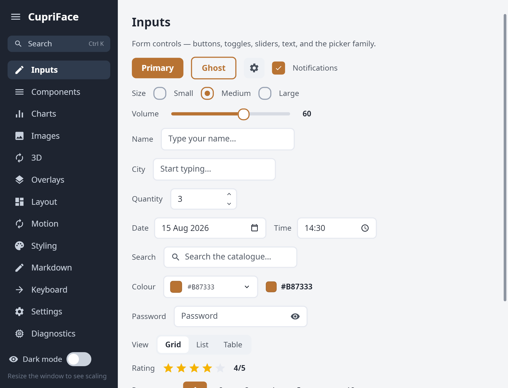

| | |
|---|---|
| 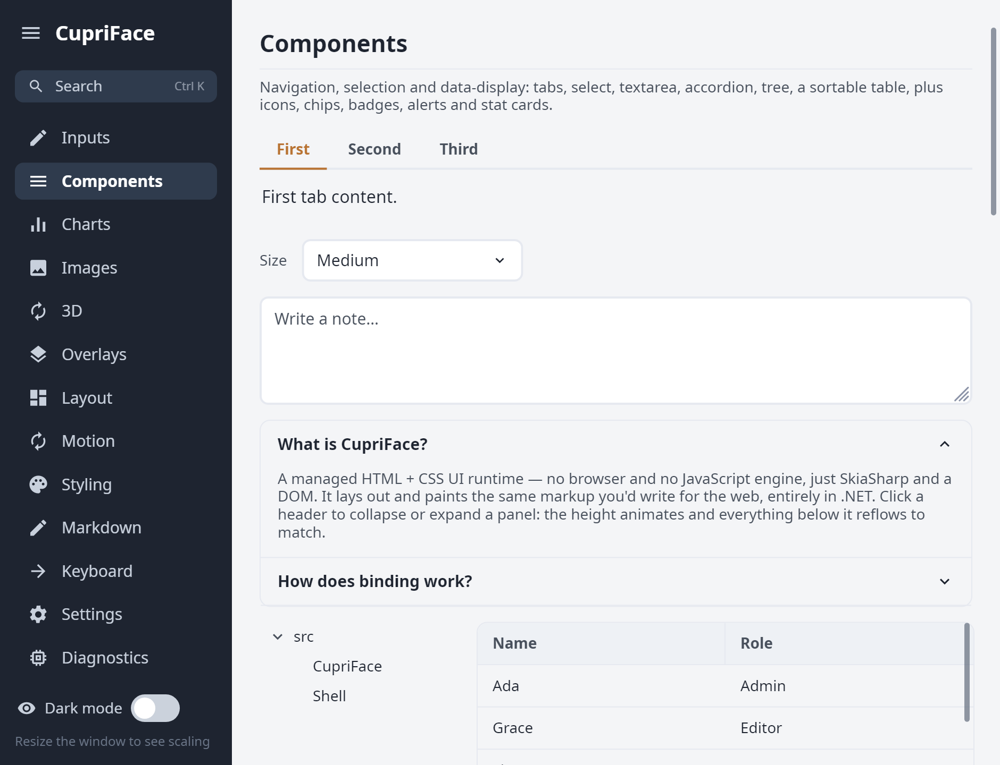<br>**Components** — tabs, tree, accordion, table with sort/select/drag-resize columns | 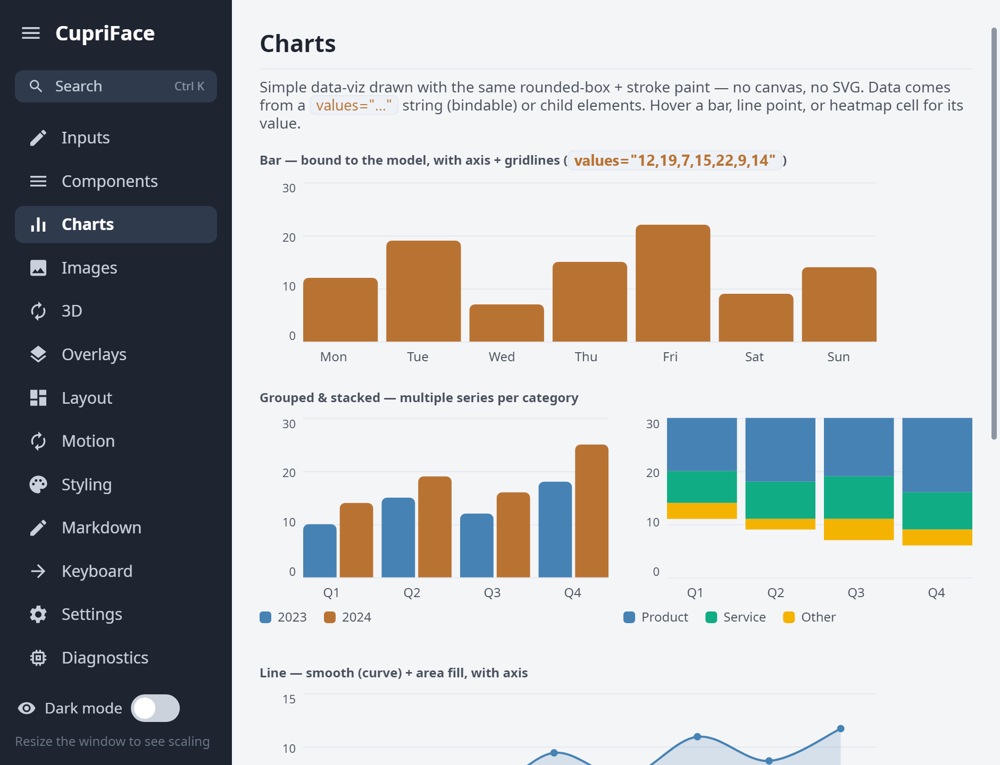<br>**Charts** — bar, grouped/stacked, line, area, heatmap, drawn with the same box+stroke paint |
| 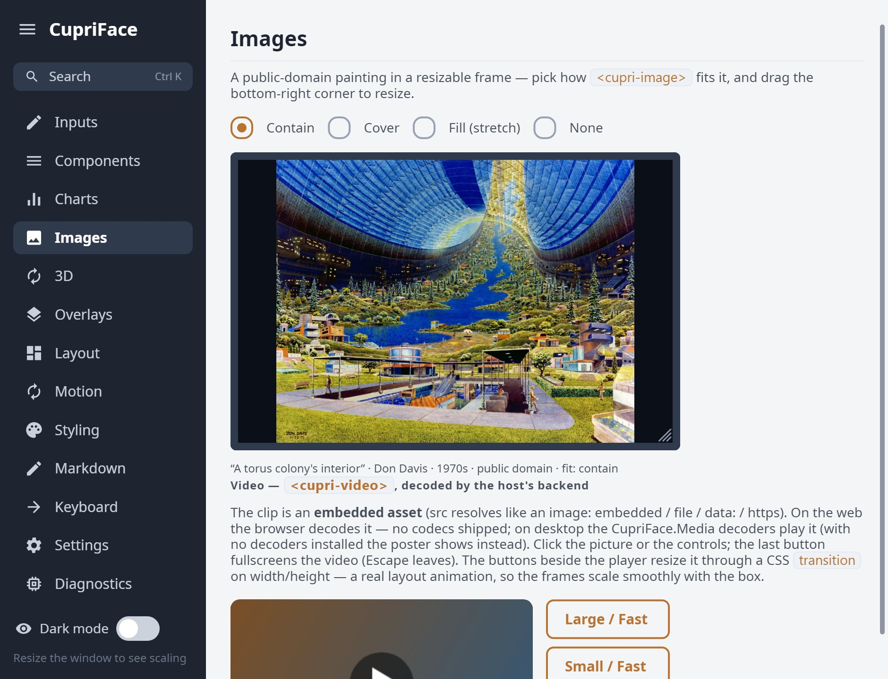<br>**Images** — `object-fit` modes in a corner-drag `resize: both` frame | 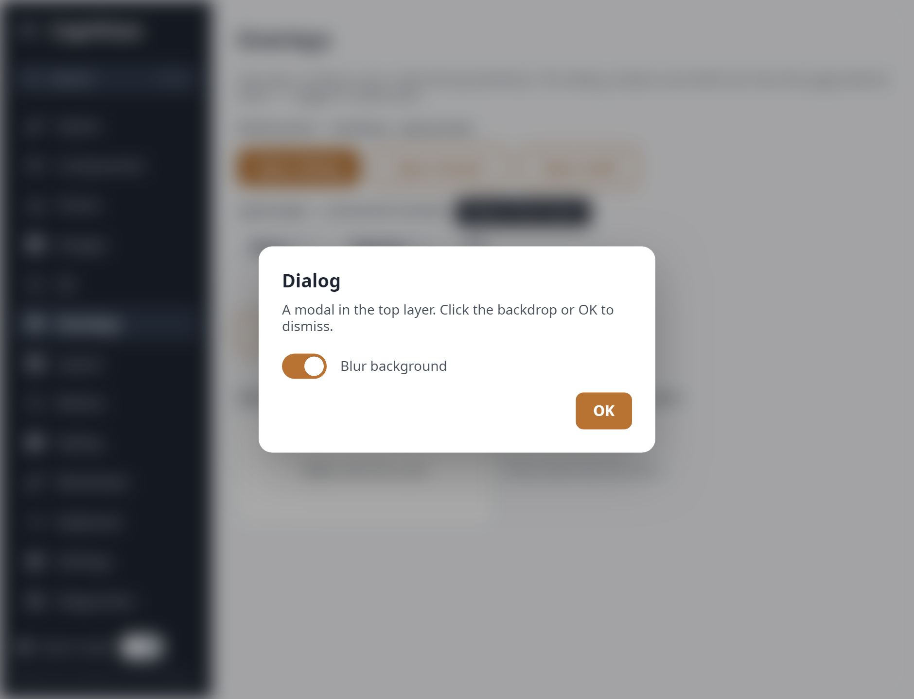<br>**Overlays** — modal dialog over a real backdrop blur; drawers, popovers, toasts, context menus |
| 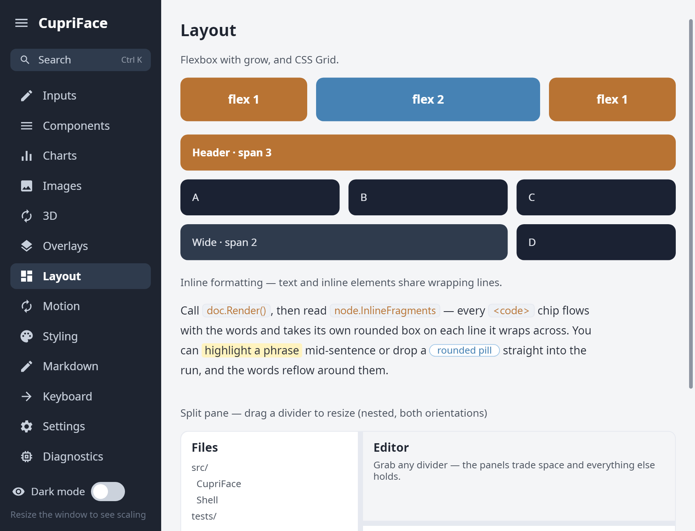<br>**Layout** — flexbox, CSS grid with spans, inline flow, draggable split panes | 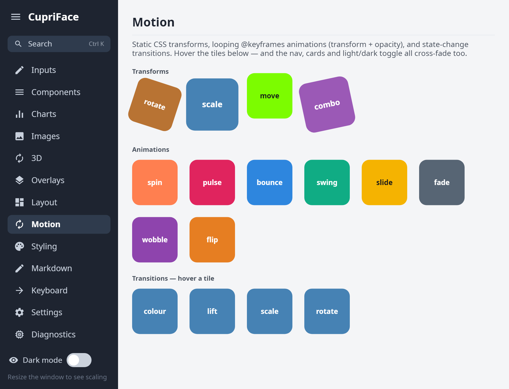<br>**Motion** — `@keyframes`, transforms and CSS transitions |
| 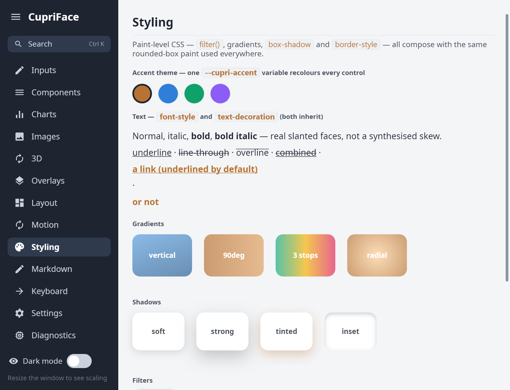<br>**Styling** — the cascade, variables, accent theming, shadows and borders | 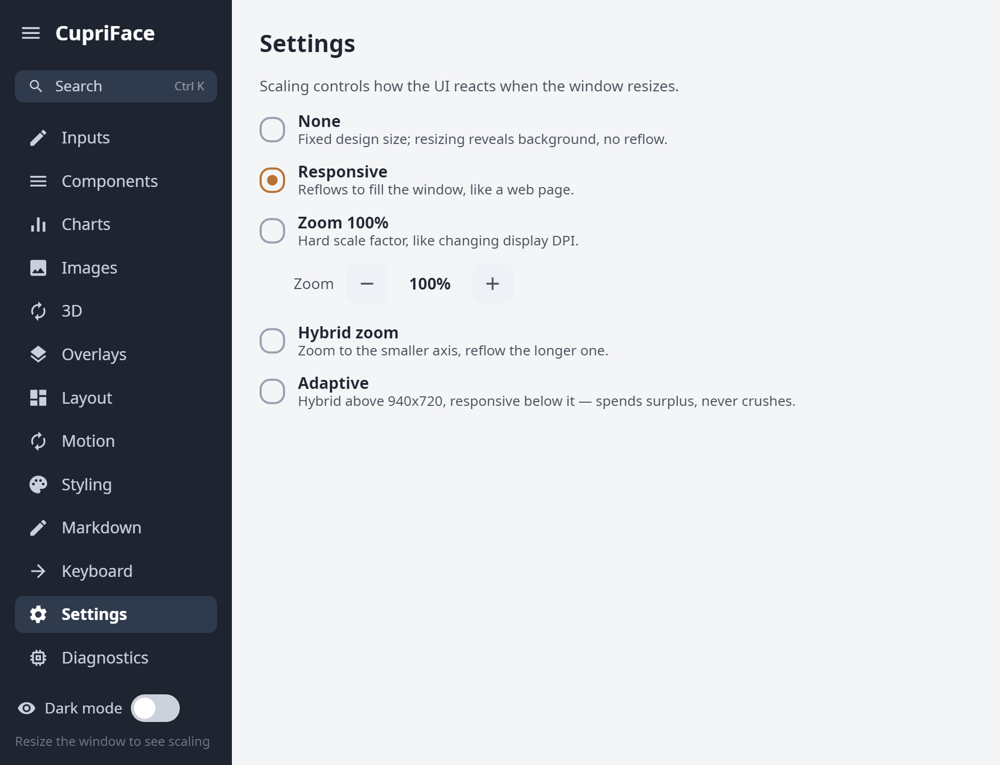<br>**Settings** — forms, validation, and the scaling modes |
| 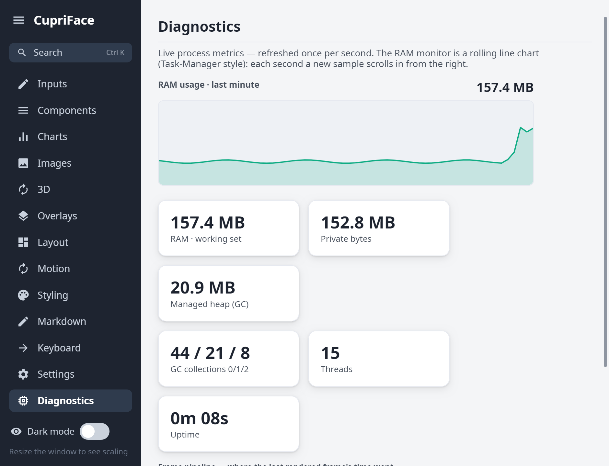<br>**Diagnostics** — live frame timings and node counts | 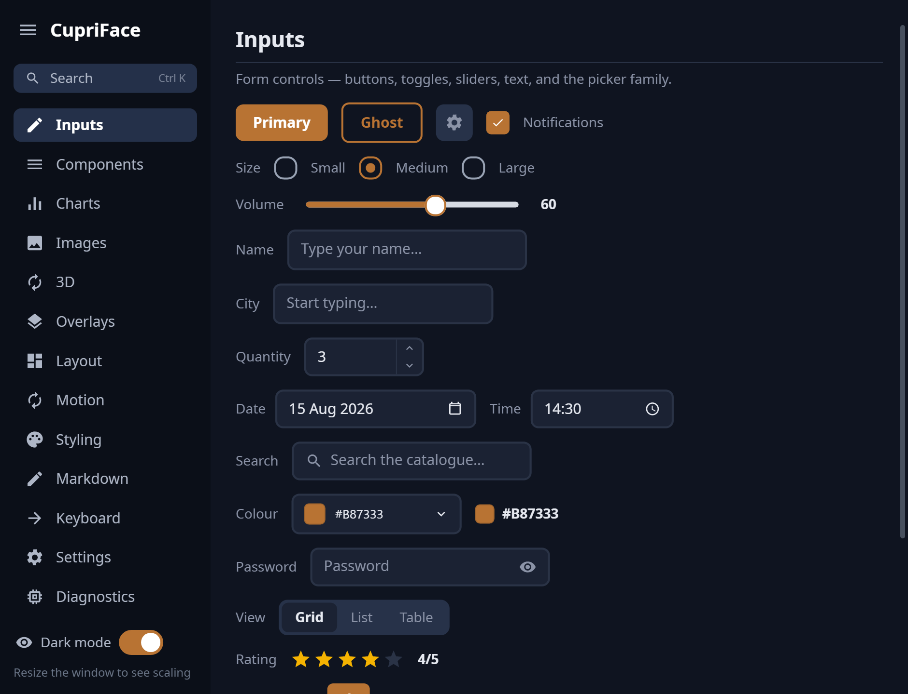<br>**Dark mode** — a CSS variable swap on `body.dark`, cross-faded by a `transition` |

Run it yourself with `dotnet run --project samples/Viewer` (desktop). The same app also runs in a
browser on a `<canvas>` (no Blazor) via `samples/WebWasm`, and on a phone via
`samples/AndroidViewer` — or download the APK from the
[latest release](https://github.com/Wixely/CupriFace/releases/latest) and sideload it.

## What works today (.NET 10)

A fully-managed pipeline **parse → style → layout → paint → bind → components**:

- **HTML + CSS** via AngleSharp DOM and a real CSS selector cascade.
- **Managed flexbox** (grow/shrink, justify/align, gap, multi-line wrap, max-content
  sizing) + block flow, box model, and absolute/relative positioning — no native Yoga.
- **HarfBuzz text shaping** (kerning, ligatures, Greek/Cyrillic/Arabic), word wrap.
- **Skia** rendering via an immutable display-list snapshot.
- **Data binding** — `{{path}}` interpolation, attribute binding, `data-repeat`
  collections, model → view refresh.
- **Component model** — custom elements expand into themed, accessible primitives;
  ships `<cupri-slider>`, `<cupri-switch>`, `<cupri-progress>`, `<cupri-button>`,
  `<cupri-badge>` with `role`/`aria-*` baked in.
- **Screen readers** — those semantics reach assistive tech on **four platforms**: UIA
  (Windows), AT-SPI (Linux), NSAccessibility (macOS) and TalkBack (Android), each proven
  in CI by a real assistive-technology client, plus a real-DOM ARIA mirror on the web host.
- **Android** — the same `CupriApp` on a phone: `CupriFace.Android` brings a GL surface,
  touch gestures (tap-on-release, momentum fling, long-press), the soft keyboard with real
  IME composition, and TalkBack. CoreCLR runtime, ~20 MB APK, driven end-to-end on an
  emulator by CI.
- **Video** — `<cupri-video>` with engine-drawn controls and fullscreen. The browser decodes
  on the web host (no codecs in the wasm binary); on desktop the optional `CupriFace.Media`
  package plays WebM (VP9 + Opus) with decoders for every desktop RID in **one** package —
  build on any OS, run on any OS.

## Projects

| Project | Role |
|---|---|
| `src/CupriFace` | The engine (DOM, CSS, layout, text, paint, binding, components) |
| `src/CupriFace.Shell` | Silk.NET window + OpenGL + Skia surface + profiler HUD |
| `src/CupriFace.Android` | Android host: `CupriActivity` + GL surface + touch/IME + TalkBack bridge (needs `dotnet workload install android`) |
| `src/CupriFace.Web.Mono` | Browser host on the Mono wasm runtime: `WebHost.Run` + canvas blit + touch/IME + ARIA mirror + browser-decoded video (no Blazor) |
| `src/CupriFace.Web.NativeAot` | Browser host compiled AOT (NativeAOT-LLVM): same `WebHost.Run`, faster, experimental toolchain |
| `src/CupriFace.Media` | Optional: WebM (VP9 + Opus) video for `<cupri-video>` on desktop |
| `src/CupriFace.Binding.Gen` | Roslyn source generator for AOT-clean binding accessors |
| `samples/HelloBox` | M0 shell smoke (window / CPU-raster) |
| `samples/HtmlView` | A real HTML/CSS document (flex, text, i18n) |
| `samples/GridDemo` · `GridAdvanced` | CSS Grid: tracks/spans; `minmax()` + row spans |
| `samples/DataBinding` | Model → view binding, before/after a model change |
| `samples/ControlsGallery` | The `<cupri-*>` control library + a11y semantics dump |
| `samples/Interactive` | Simulated clicks → hit-test → control behaviour (headless) |
| `samples/Motion` | `transform` + `@keyframes` animation (time-sampled) |
| `samples/Responsive` | `@media` queries + `calc()` across widths |
| `samples/BidiText` | Mixed LTR/RTL (Arabic/Hebrew) shaping + reorder |
| `samples/ThreadedRender` | Render-thread split (commit on UI thread, raster on another) |
| `samples/MediaProbe` | Headless WebM decode (also CI's build-on-Windows/run-on-Linux gate) |
| `samples/DemoApp` | **Portable apps** (`ShowcaseApp` — the screenshots above — plus `SettingsApp`/`ControlsApp`), one definition each, no platform code |
| `samples/Viewer` | Desktop host running `ShowcaseApp` (GPU → SDL fallback, live animation); `--app mobile` runs the phone sample |
| `samples/AndroidViewer` | The phone-first `MobileApp` on Android (the Showcase reachable from its About page) |
| `samples/WebWasm` | The Showcase in the browser: three lines of app over `CupriFace.Web.Mono` |
| `samples/Web` | Web host (alt): a **minimal** Blazor `<SKCanvasView>` embedding example — clicks only, see below |
| `samples/Demo3d` | The Showcase's **3D** page: a small glTF/PBR renderer behind `ISurfaceSource`, composited two different ways depending on the host |

## Download

Prebuilt **standalone** Showcase demos — self-contained single executables, no .NET install
required — are attached to each release:
**[latest release](https://github.com/Wixely/CupriFace/releases/latest)**.

| Platform | Asset | Run |
|---|---|---|
| Windows x64 | `CupriFace-Viewer-<version>-win-x64.exe` | run it |
| Linux x64 | `CupriFace-Viewer-<version>-linux-x64.tar.gz` | `tar xzf <file> && ./Viewer` |
| macOS (Apple Silicon)* | `CupriFace-Viewer-<version>-osx-arm64.tar.gz` | `tar xzf <file> && xattr -d com.apple.quarantine Viewer && ./Viewer` |
| Android (arm64)† | `CupriFace-Viewer-<version>-android-arm64.apk` | allow "install unknown apps", then open the APK |

† The Android build is the phone-first sample (the desktop Showcase is reachable from its About
page). It is signed with a CI debug key that changes every build, so **uninstall any previous
CupriFace Viewer first** — Android refuses the update as a signature mismatch otherwise. Its About
page states the version and build stamp, which is the quickest way to confirm what you installed.

\* macOS builds ship from releases after v0.1.0 (the build is unsigned, hence the `xattr`
quarantine strip). CI builds and runtime-smokes all three platforms on every push.

The first launch unpacks the bundle and takes a few seconds; later launches are about 1.5 s.

On Linux without a GPU the app renders through Mesa's software rasteriser automatically. If you
ever want to skip the OpenGL path entirely (or are on a build from before 2026-08, which crashed
in that configuration), `CUPRIFACE_SOFTWARE=1 ./Viewer` forces the SDL software window.

To **build against** CupriFace rather than just run the demo, the same release carries NuGet
packages (`.nupkg` + `.snupkg` symbols): `CupriFace` is the engine, `CupriFace.Shell` the desktop
host. They are not on nuget.org yet — download them and add the folder as a local package source.

## Run

```pwsh
# The full solution includes the Android and WebAssembly hosts.
dotnet workload restore CupriFace.slnx
dotnet build CupriFace.slnx -c Debug

# Each sample writes a PNG snapshot (works headless — no GPU needed):
dotnet run --project samples/HtmlView          # -> m1-html.png
dotnet run --project samples/DataBinding        # -> m4-bind-a.png / m4-bind-b.png
dotnet run --project samples/ControlsGallery    # -> m5-controls.png

# Live, clickable window — tries GPU, falls back to a CPU (no-GPU/RDP) window:
dotnet run --project samples/Viewer

# Web (WASM) — engine rendered to <canvas> in the browser. Two interchangeable hosts:
dotnet run --project samples/WebWasm -c Release   # raw .NET-WASM (no Blazor, default)
dotnet run --project samples/Web                  # Blazor host (alternative)
# ...then open the printed localhost URL.
```

Both web hosts render the **same** `SettingsApp` — pick raw-WASM for minimal deps, or
Blazor to embed CupriFace inside an existing Blazor app. First build does a native
WebAssembly relink of Skia (slow once, cached after).

**The Blazor host is a starting point, not a finished host.** It is ~30 lines showing how to put
the engine inside a `<SKCanvasView>`, and it wires **clicks only** — no scrolling, no keyboard, no
touch. `samples/WebWasm` is the one that carries the full input contract (tap-on-release, momentum,
long-press, IME composition, the coarse/fine capability signal), and it is what the browser gate
tests. If you are embedding in an existing Blazor app, expect to bring input across yourself —
`CupriDocument` exposes the same `Dispatch*` seam both other web hosts use.

Every snapshot sample writes a PNG and exits (works headless, no GPU). The Viewer and
Web targets open a real window / browser.

## Write once, run desktop, mobile **and** web

Define an app once as a `CupriApp` (markup + CSS + model + handlers — **no platform code**),
then host it anywhere:

```csharp
public sealed class SettingsApp : CupriApp {           // in a portable class library
    public override string Html => "...";
    public override string Css  => "...";
    public override object Model => _settings;
    public override void Configure(CupriDocument d) => d.OnClick(".save", _ => Save());
}
```

```csharp
DesktopHost.Run(new SettingsApp());                    // desktop  (GL → SDL window)
```
```razor
<CupriView App="new SettingsApp()" />                  @* web  (WASM → <canvas>) *@
```
```csharp
public sealed class MainActivity : CupriActivity {     // Android (GL surface, touch, IME, TalkBack)
    protected override CupriApp CreateApp() => new SettingsApp();
}
```

"Exporting a desktop app as a website" = recompiling the same `SettingsApp` against the
web host. The engine, layout, styling, binding, components, and click handling are shared
unchanged; only the host (window vs. canvas) differs.

### Handling input

`Configure` is where an app wires interaction, with the same handlers on every host:

| | Fires when |
|---|---|
| `d.OnClick(selector, …)` | a click bubbles up to an element matching the CSS selector |
| `d.OnAction("data-…", …)` | an element (or an ancestor) carrying that attribute is clicked **or** activated from the keyboard |
| `d.OnContext("data-…", …)` | …the same element is right-clicked or long-pressed, for a context menu |
| `d.OnSubmit("data-…", …)` | a field marked `submit-on-enter` takes a plain Enter (Shift+Enter still inserts a newline) |
| `d.OnShortcut(mods, key, …)` | a keyboard chord — a character (`"k"`) or a named key (`"Enter"`, `"Escape"`, `"Tab"`, an arrow) |

Links are the one exception. `<a href>` is claimed by the engine, so `OnClick("a", …)` never fires for
an anchor; subscribe to **`d.Navigated`** instead. It carries every non-`#` href, and its `External` flag
separates a route the app should handle itself from one the host should open in a browser:

```csharp
doc.Navigated += e => { if (!e.External) GoTo(e.Href); };   // in-app routing; hosts open the rest
```

In-page `#fragments` never reach it — the engine scrolls those into view itself.

**Wire all of it inside `Configure`**, including the `+=` events (`Navigated`, `FormSubmitted`,
`ContextRequested`, `WindowCommandRequested`). `Configure` runs once per document, from
`CreateDocument`. Handlers survive a rebuild, so a long-lived document keeps them — but an app that
builds a *new* `CupriDocument` per page, as a browser or a router does, and subscribes once outside
`Configure` wires the first document and none of the ones that replace it. That failure looks like
the feature working and then quietly stopping, which is the hardest kind to trace back.

### Two ways to reach a browser

| | Where the engine runs | Download | Needs a WASM build? |
|---|---|---|---|
| `samples/WebWasm` | In the browser (.NET WASM → `<canvas>`), Mono-interpreted | the whole engine | yes |
| `samples/WebLlvm` | In the browser, NativeAOT-LLVM — same engine, ~7x faster than interpreted | 14.2 MB (5.5 MB gzipped) | yes |

Both compile the *same* `ShowcaseApp`; only the compiler differs. `WebLlvm` is where this is
heading — it removes the interpreter tax (a hover restyle measured at 2.1 ms against 16.2 ms) — and
`WebWasm` remains the one that builds with nothing but the stock SDK and the wasm workload.

## License note

All third-party dependencies are permissive (MIT / Apache-2.0): SkiaSharp,
HarfBuzzSharp, Silk.NET, AngleSharp. The flexbox engine is our own managed code (no
native Yoga), keeping the stack fully managed and AOT-friendly.
